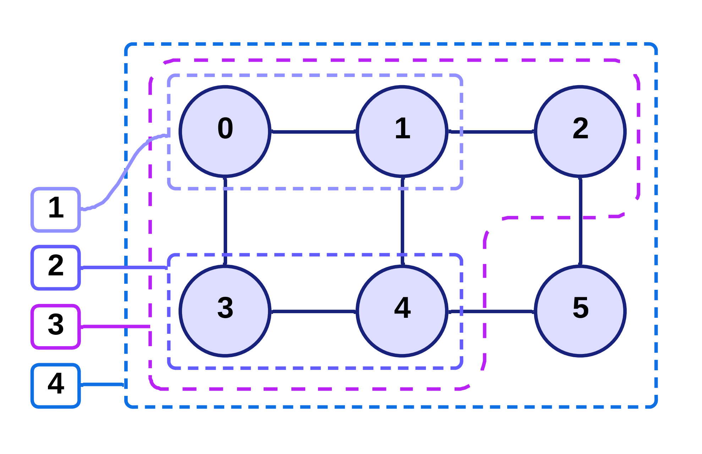

# Exploring optimal contraction strategies for fast vector scalar product in Tensor-Train format

# Algorithms


# Preparing the environment

### Cloning the repository
In order to clone the repository, use the git client of your choosing, for example:
```
https://github.com/Blixodus/OptiTenseurs.git
```

### Cloning the external dependencies
Our project relies on [pybind11](https://github.com/pybind/pybind11) library, in order to launch Python interpreter from C++ code, therefore after cloning the repository, the submodules needs to be initialized using the following commands:

```
git submodule init
git submodule update
```

### Preparing Python environment and dependencies
[Ruche only step] Load the necessary modules.
```
module load anaconda3/2024.06/gcc-13.2.0
module load gcc/13.2.0/gcc-4.8.5
module load cmake/3.28.3/gcc-11.2.0
```

We recommend using Conda manage Python version and necessary dependencies. You can create new Conda environment with Python 3.12.4 using the following command:
```
conda create --prefix ./tt_contr_conda python=3.12.4 --channel conda-forge
source tt_contr_env/bin/activate
conda config --set pip_interop_enabled True
```
If you opt for using your own Python environment, make sure to include Python-dev package, as the project relies on Python.h header file and Python.so library.

After activating the environment, install necessary Python packages.
```
conda install conda-forge::cotengra
conda install conda-forge::alive-progress
pip install kahypar cgreedy
```

# Compilation and usage

## Compilation
In order to compile the project along with all available algorithms and tools, use the following commands:
```
cmake -B build
cd build
make -j
```

## Usage
[Ruche only step] Load the necessary modules.
```
module load anaconda3/2024.06/gcc-13.2.0
module load gcc/13.2.0/gcc-4.8.5
module load cmake/3.28.3/gcc-11.2.0
```

Activate the Python environment.
```
source tt_contr_env/bin/activate
```

Run the project with the following command:
```
./build/OptiTenseurs -a "[arguments]" -f [test case filename]"
```
where `argument` is a dictionary of parameters, which include:
* `main_alg` - the main algorithm to be used (`OneSidedOneDim`, `TwoSidedDeltaDim`, `CotengraWrapper`),
* `tt_dim` - problem type (for example 2 for $xy$ case, 3 for $xAy$ case, 4 for $xABy$ case),
* `delta` - the maximum size of the window (for $2-sided$ $\Delta-dim$ algorithm),
* `ctg_algorithm` - the algorithm from Cotengra library which should be used by our wrapper (when `main_alg` is set to `CotengraWrapper`).

### Examples
In order to run $2-sided$ $\Delta-dim$ algorithm with $\Delta=4$ on the $xx^T$ test case, use the following command:
```
./OptiTenseurs -a "main_alg TwoSidedDeltaDim tt_dim 2 delta 4" -f /path_to_tests/xxT/random/low/d_003_v001.txt
```

In order to run $Hyper-Greedy$ algorithm using Cotengra wrapper on the $xAy$ test case, use the following command:
```
./OptiTenseurs -a "main_alg CotengraWrapper tt_dim 3 ctg_algorithm hyper-greedy" -f /path_to_tests/xAy/quantized/medium/d_004_v002.txt
```

# Input and output formats
## Input: tensor-train network format
Tensor-train networks are defined as text files which use the following format:
* lines starting with 'c' are comment lines, and are not taken into account by the parser,
* lines starting with 'v' are a visual representation of the tensor-train network, and are not taken into account by the parser,
* single line starting with 't' followed by the number of rows (tt_dim) of the tensor-train,
* single line starting with 'd' followed by the dimension (width) of the tensor-train,
* lines starting with 'e' describe contraction weight: 'node1 node2 weight' (as weight of the edge between node1 and node2).

## Output: contraction orderding format
The contraction order returned by $1-sided$ $1-dim$ and $2-sided$ $\Delta-dim$ algorithms, as well as Cotengra library algorithms run using our wrapper, uses a recursive definition the contractions.

{: width="50%"}

For example for contractions presented above, the order returned by the algorithm would be defined as `((((0, 1), (3, 4)), 2), 5)`, which can be represented in form of list of nodes to be contracted as `[(0, 1), (3, 4), (0, 3), (0, 2), (0, 5)]` (assuming that node with lower id represents the result of each contraction). 

For convenience, we have provided the script to flatten the recursive order definition:
`tools/flat_order.py`.


# OptiTenseurs
The goal of this project is to implement algorithms capable of finding the best order of contraction of any tensor train, given the size of each vertex's dimension.

# Structure

* 'results' : contains all exported results, it is the default root directory for output files.
* 'instances' : contains the network files, it is the default root directory for input files.
* 'src' : contains all the main algorithms (divided in their own sub-directories), the components that define the networks and some types, as well as the main .cpp file that will process the execution queue.
* 'tools' : contains quality-of-life programs such as the code that displays a TT, the code to test contraction orders, and the code to generate instances.
* 'GUI' : contains the python code for the graphical user interface.

# Compiling
This program is compiled using xmake, you can use the following command :  
```
mkdir [build_directory]
```  
```
xmake f -o [build_directory] 
```
(default is 'build')  
```
xmake b [target]
```  
The targets are :  

* AllEdgeByEdge  
* AllSplits  
* ConvexSplits  
* GreedyEdgeSort  
* OneSideDimByDim  
* SplitsDimByDim  
* OptiTenseurs, which is the general caller to the other algorithms

# Executing
You can run the program using  
```
xmake run -w . [target] [file_name]
``` 
(although this is deprecated and not recommanded)  
or  
```
xmake run -w . OptiTenseurs -a dictionary1 ... dictionaryN -f network_file1 ... network_fileN -o output_file
```  
Where each dictionary is a string with format : "key1 val1 key2 val2 ... keyn valn"
The keys are :  

* "main_alg" : (Algorithm name) The main solver, corresponds to the target and .cpp name (default : none)
* "dmin" : (integer) Minimum size in number of vertex, edge, or dimension (depends on the main algorithm) of the network the algorithm can handle, before delegating to sub_alg. (default : 1) (Not implemented) 
* "dmax" : (integer) Limiting factor in number of vertex, edge, or dimension (depends on the main algorithm). Implementation varies for each algorithm. Limits the size of the sub-networks that can be considered/generated by the algorithm, the accumulation of edges (default : depends on algorithm)
* "sub_alg" : (Algorithm name) Secondary algorithm to solve networks of size < dmin. (Not implemented) (default : none)
* "start_sol" : (Algorithm name) Algorithm to initialize the solution with, for pruning. (Implemented, but not fully operational) (default : none)
* "time" : (integer) Time alloted to an algorithm for each execution (in minutes). After a timeout an algorithm is kicked out of the execution queue permanently (default : 10)
* "test" : ({0, 1}) Wheter the solution found by the algorithm should be tested. For debugging purpose, not available for every algorithm (default : 0) (only available to the algorithms which contraction order we manage to recover)

An example of a valid command can be found in exec_example.sh.

Alternatively, you can use the GUI to select the parameters and execute the code. You can also use it to generate the execution command and copy it to your clipboard.

# Algorithms
The code currently supports 6 algorithms.
We note D, the dimension of a network.
We note "explicit edges" the edges of the network, and "implicit edges" the edges of weight 1 that implicitly link every vertices together.

1. ### AllSplits
    * Type : exact, dynamic programming
    * Description : Solves every possible splits (over the vertices) of the network
    * Complexity : 2^4D

2. ### AllEdgeByEdge 
    * Type : theoretically exact (need proof), iterative (edges)
    * Description : Solves every contraction order of the network
    * Complexity : 
    * Remark : Unlike AllSplits which consider every splits possible, this algorithm only considers the explicit edges.

3. ### ConvexSplits
    * Type : heuristic (close to exact), dynamic programming
    * Description : Solves every possible convex splits (over the vertices) of the network
    * Complexity : 
    * dmax : Limits how many edges can be crossed when splitting
    * Remark : By virtue of being unable to generate concave sub-problem, this algorithm is not exact. However it is unlikely to find a network where the optimal solution would require a concave decomposition. Determining the best and worst network-structure for this algorithm could be interesting.

4. ### GreedyEdgeSort
    * Type : greedy, iterative (edges)
    * Description : Solves a single contraction order, sorts the edges by weight^2/contraction_cost (descending order), re-computed at each iteration.
    * Complexity : D*log(D!)
    * Remark : This algorithm attempts to minimize the overall weight of the network, while not skyrocketting the final cost. This strategy is both cheap and consistently good, which makes its solution a good starting point for any algorithm. Additionaly, a thorough analysis of the network could provide information that would allow more constraint to be added in order to approach the optimal solution.

5. ### OneSideDimByDim
    * Type : heuristic, iterative (edges + dimensions)
    * Description : Explores the solutions by going from one side of the network to the other. Contracts 2 edges in {upper, central, lower} per dimension.
    * Complexity : 
    * dmax : The amount of central edges that can be accumulated
    * Remark : Each dimension is composed of 3 edges, two lateral and one central. Once 2 edges have been contracted on that dimension, the remaining edge fuses with the next central edge. Hence why it is interesting to limit how many central edges can fuse together.

6. ### SplitsDimByDim :
    * Type : heuristic, iterative (dimensions) + dynamic programming
    * Description : Iterates over d in [1, dmax], then splits the network in 2 sub-networks of dimensions d and D-d.
    * Complexity : 
    * dmax : 


# Experiments

## Generating test cases

## Computing the results

## Plotting the results


# Known bugs


Bug | Occurrence | Cause
----|----|----
SplitsDimByDim returns 2^63 | Past 50 dimensions | In solve(), when the best_cost for state2 is computed.
ConvexSplits undershoots the best cost | If best_cost is initialized as something close to the max of int64 | Likely an overflow in some part of the code, because it is unlikely that a network actually lends a result greater than 2^63, it is more likely that a value is summed to best_cost at some point.

# Additional Notes
* AllSplits is slower than AllEdgeByEdge and should therefore be ignored.  
* AllEdgeByEdge should be replaced by a proper dynamic programming algorithm.  
* More naive algorithms should be implemented.  
* Results visualization does not properly support having the same algorithm executed multiple time on the same network, but could be added.  
* A slider could be added to select the range of networks to display (a zoom essentially).
* GreedyEdgeSort is a bit rough around the edges (mostly the sorting part), it has no excuse to be this slow, considering the range of solution it explores (1).

```
wget https://xmake.io/shget.text --no-check-certificate  -O - | bash
source ~/.xmake/profile
xmake f -m release --clean --cxx=g++ --cxxflags="-std=c++23 `python3-config --ldflags` `python3-config --includes`" -o build


xmake f -m release --clean --cxx=g++ --cxxflags="-std=c++23 `python3-config --ldflags` -rdynamic  `python3-config --includes`" -o build
```
xmake f -m release --clean --cxx=g++ --cxxflags="-std=c++23 -Wl,--export-dynamic -Wl,--whole-archive /gpfs/softs/languages/python/3.12.4/lib/libpython3.12.a -Wl,--no-whole-archive `python3-config --ldflags` `python3-config --includes`" -o build

 xmake f -m release --clean --cxx=g++ --cxxflags="-std=c++23 -Wl,--export-dynamic -Wl,--no-whole-archive `python3-co
nfig --includes`" -o build